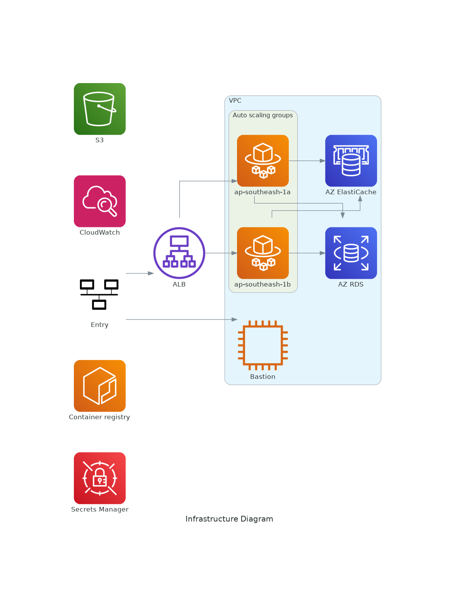

The infrastructure is managed using Terraform, and the relevant code can be found in the [Terraform repository](https://github.com/Nihisil/nimble-devops-ic-infrastructure). 

Here is a diagram illustrating the infrastructure:

